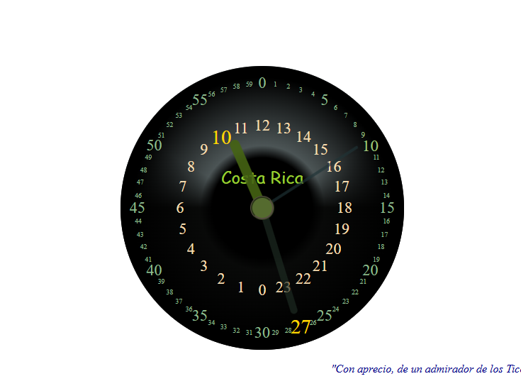

# My Cherished Project

This is a project I created when I fully mastered HTML, CSS, and JavaScript for the second time. 

Today, AI can generate similar projects with ease, but this one was crafted entirely by hand, and it always leaves a lasting impression on me. Even now, I find it to be perfect—though true perfection may not exist. 

When I was about to upload it to my portfolio, I realized that this project is more than just code; it is a creation I will always cherish. Among all my works, this one feels like the perfect piece.

---

### 🔥 Why This Project Matters to Me
- **Handcrafted Excellence** – Built with pure HTML, CSS, and JS, without any AI assistance.
- **Timeless Beauty** – No matter how much time passes, it still feels special.
- **A Symbol of Mastery** – It represents a milestone in my journey as a developer.

---

### 🛠️ Technologies Used
- HTML
- CSS
- JavaScript

---

### 📷 Preview

> *Perfection is an illusion, but some creations come close.*

---

🎯 **To explore more, check out the full repository!**
